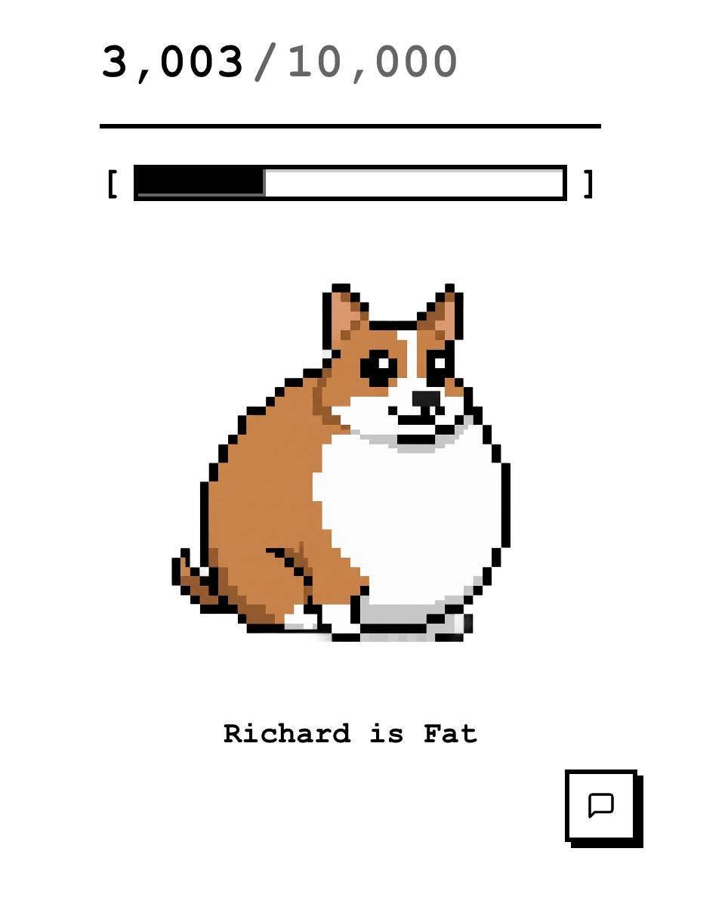

# Buildathon

A fitness tracking app with step counting and AI-powered chat assistance.

## The Problem

Staying consistent with health and fitness goals is one of the biggest challenges people face. Motivation wanes, habits break, and it's easy to lose track of progress when you're only accountable to yourself.

## The Solution

**Take responsibility for your health by caring for another.**

Buildathon transforms your fitness journey by giving you a virtual companion that depends on your activity. By tracking your steps and maintaining healthy habits, you're not just improving yourself—you're caring for a digital friend who needs you to stay active.



When you take care of someone else (even a virtual pet), you're more likely to stay consistent because the responsibility extends beyond just yourself. Your companion's wellbeing is directly tied to your daily activity, creating a powerful motivation to maintain healthy habits.

## Project Structure

- `client/` - React frontend (Vite)
- `server/` - Bun backend with OpenAI integration

## Development Setup

### Backend

1. Navigate to `server/` directory
2. Create a `.env` file with your OpenAI API key:

   ```env
   OPENAI_API_KEY=your_key_here
   PORT=3001
   ```

3. Install dependencies and run:

   ```bash
   cd server
   
   bun install
   bun run dev
   ```

### Frontend

1. Navigate to `client/` directory
2. Install dependencies and run:

   ```bash
   cd client
   pnpm install
   pnpm dev
   ```

The frontend will proxy `/api/*` requests to the backend server automatically.

## Cloudflare Tunnel Setup

When using Cloudflare Tunnel (cloudflared), both frontend and backend can be accessed through the same domain:

1. **Development**: The Vite dev server proxies `/api/*` requests to the backend automatically
2. **Production**:
   - Option A: Deploy backend as Cloudflare Worker/Pages Function
   - Option B: Use Cloudflare Workers to proxy requests to your backend
   - Option C: Run both services and configure Cloudflare routing

The frontend defaults to `/api` for API requests, which works seamlessly with the Vite proxy in development and can be configured for production via `VITE_CHAT_API_URL` environment variable.
